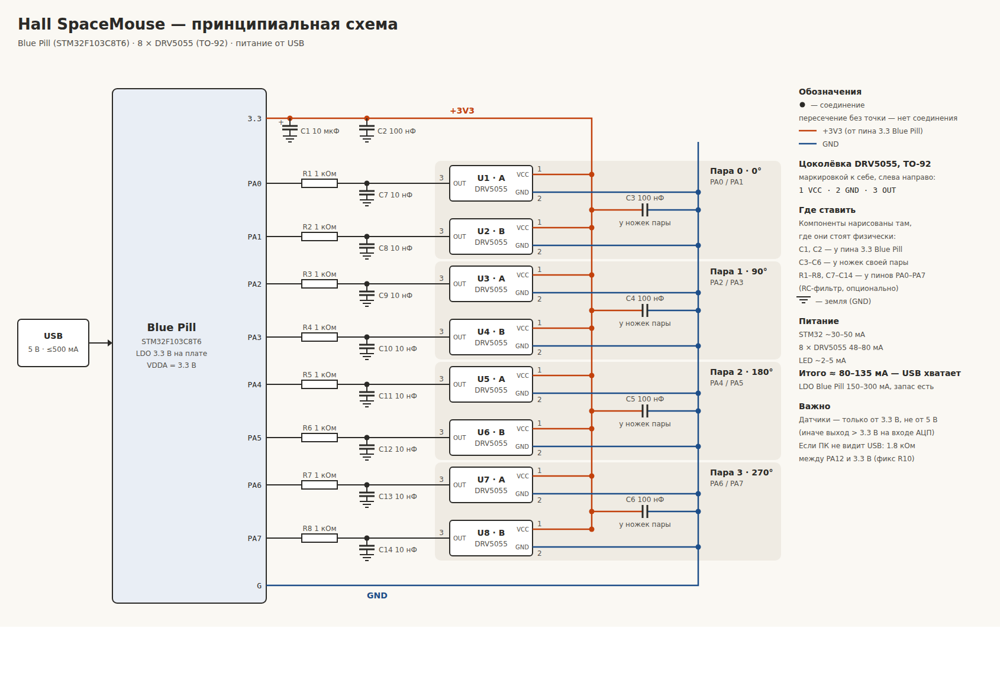

# SpaceRat

Самодельная 3D-мышь (6 степеней свободы) на датчиках Холла — аналог 3Dconnexion
SpaceMouse. Работает с родным драйвером **3DxWare под Windows**: ПК видит её как
**SpaceMouse Pro Wireless**, кнопкам назначаются действия в каждой программе.



## Что внутри

| | |
|---|---|
| Контроллер | Blue Pill (STM32F103C8), USB |
| Датчики | 8 × DRV5055A3 (линейные датчики Холла, TO-92), 4 пары по кругу |
| Магниты | 4 × NdFeB 10×2 мм в подвижной рукоятке |
| Управление | 5 клавиатурных свичей + энкодер EC11 с кнопкой |
| Подсветка | кольцо WS2812 под рукояткой: ровное янтарное свечение, реагирует на движение ручки; подсказки калибровки |
| Прошивка | Rust + [Embassy](https://embassy.dev) |

**Возможности прошивки:**
- 6 осей из 4 пар датчиков: сдвиги X/Y/Z и наклоны/поворот Rx/Ry/Rz;
- калибровка нуля при каждом включении и подстройка дрейфа;
- **калибровка прямо на мыши** (SW1 + SW5 при включении): 6 движений по подсказкам
  кольца, вычисляется матрица, убирающая взаимное влияние осей; результат во flash;
- 8 кнопок SpaceMouse Pro: 5 свичей, щелчки энкодера влево/вправо и его нажатие;
- кольцо откликается на движение: нажали — ярче, подняли — тусклее, куда
  сдвигаем, наклоняем или поворачиваем — та сторона ярче;
- энкодер на аппаратном декодере TIM4, кольцо — через TIM1 + DMA.

## Документация

| Что | Где |
|---|---|
| Схема датчиков и питания | [`docs/hardware/spacemouse_schematic.svg`](docs/hardware/spacemouse_schematic.svg) |
| Схема кнопок, энкодера и кольца | [`docs/hardware/buttons_encoder_schematic.svg`](docs/hardware/buttons_encoder_schematic.svg) |
| Размеры механики (магниты 10×2) | [`docs/hardware/mechanics_layout.svg`](docs/hardware/mechanics_layout.svg) |
| Печатная плата под ЛУТ (односторонняя) | [`pcb/README.md`](pcb/README.md) |
| Распиновка, компоненты, механика, формулы осей | [`docs/hardware/README.md`](docs/hardware/README.md) |
| Прошивка: сборка, прошивка, калибровка, настройки | [`firmware/README.md`](firmware/README.md) |
| USB HID SpaceMouse: дескрипторы, отчёты, частоты | [`docs/firmware/usb-hid-protocol.md`](docs/firmware/usb-hid-protocol.md) |

## Быстрый старт

1. **Собрать железо** по схемам и чертежу размеров (`docs/hardware`); плату можно
   изготовить ЛУТом по [`pcb/`](pcb/README.md).
   Важно: датчики питаются только от 3.3 В; кольцо — отдельной парой 5V/GND.
2. **Указать своё кольцо** в [`firmware/src/config.rs`](firmware/src/config.rs):
   `LED_COUNT`, при необходимости `LED_FIRST_ANGLE_DEG` и `LED_CLOCKWISE`.
3. **Собрать и прошить** (нужен Rust и ST-Link):
   ```sh
   cd firmware
   cargo run --release        # через probe-rs; вариант с .bin — в firmware/README.md
   ```
4. **Включить, не трогая ручку ~1 с** (калибровка нуля).
5. **Откалибровать:** зажать SW1 + SW5, подключить USB, выполнить 6 движений
   по подсказкам кольца ([порядок](firmware/README.md#калибровка)).
6. **Проверить в 3DxWare** направления осей; если ось наоборот — `INVERT` в `config.rs`.

## Структура репозитория

```
firmware/               прошивка (Embassy, STM32F103C8)
  src/config.rs         все настройки
docs/hardware/          схемы, чертёж, распиновка, компоненты
  tools/                скрипты, генерирующие SVG-схемы
docs/firmware/          USB HID-протокол SpaceMouse
pcb/                    односторонняя плата под ЛУТ: печать 1:1, сборка, генератор
tests/firmware_logic/   тесты логики прошивки на ПК (cargo test)
```

## Состояние

Прошивка собирается, логика (энкодер, оси, мастер калибровки, хранение, кольцо)
покрыта тестами на ПК. **На собранном устройстве ещё не проверялась** —
распознавание в Windows/3DxWare, тайминги WS2812 и шум АЦП подтвердятся на железе.

## Основано на

- [AndunHH/spacemouse](https://github.com/AndunHH/spacemouse) (развитие
  «Open Source SpaceMouse» TeachingTech) — HID-дескриптор, VID/PID, раскладка
  кнопок, вариант на 8 датчиках Холла;
- [FreeSpacenav/spacenavd](https://github.com/FreeSpacenav/spacenavd) — таблица
  устройств 3Dconnexion и номера кнопок SpaceMouse Pro.

## Лицензия

[MIT](LICENSE).

> VID 0x256F принадлежит 3Dconnexion. Эмуляция их USB-идентификаторов — только
> для личного использования, не для продажи устройств.
