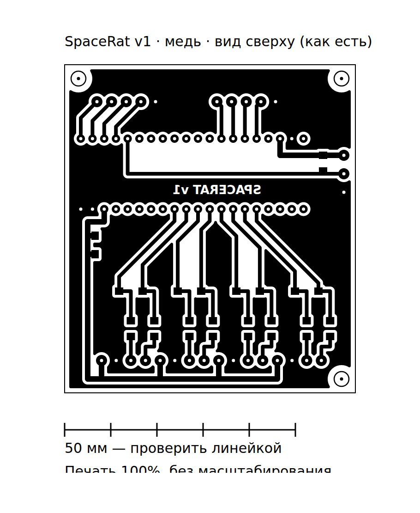

# SpaceRat — плата v1 (односторонняя, под ЛУТ)

Плата-«материнка» под Blue Pill: RC-фильтры датчиков, конденсаторы питания,
подтяжка кольца и площадки под провода. Blue Pill ставится на гнёзда,
всё остальное (датчики, кнопки, энкодер, кольцо) подключается проводами.



| Файл | Что |
|---|---|
| [`spacerat_copper_print.pdf`](spacerat_copper_print.pdf) | **для печати**: медь 1:1 на A4, с линейкой 50 мм |
| [`spacerat_copper_print.svg`](spacerat_copper_print.svg) | то же в SVG (размеры в мм) |
| [`spacerat_assembly.svg`](spacerat_assembly.svg) / [`.png`](spacerat_assembly.png) | сборка: вид сверху (Blue Pill, провода) и со стороны меди (SMD) |
| [`gen_pcb.py`](gen_pcb.py) | генератор + проверка платы |

## Параметры

| | |
|---|---|
| Размер | 63 × 71 мм, стеклотекстолит 1–1.5 мм, медь с одной стороны |
| Дорожки | 0.8 мм сигнал, 1.2 мм питание |
| Зазоры | ≥ 0.6 мм (проверено генератором), свободная медь залита землёй |
| Компоненты | SMD 1206 — паяются **со стороны меди** |
| Сверловка | 1.0 мм — все площадки; 3.2 мм — крепёж М3 (3 шт.) |

## ⚠️ До травления: проверить Blue Pill

Плата рассчитана на распространённую распиновку Blue Pill и расстояние между
рядами **15.24 мм (0.6")**:

```
ряд 1: B12 B13 B14 B15 A8 A9 A10 A11 A12 A15 B3 B4 B5 B6 B7 B8 B9 5V G 3.3
ряд 2: G   G   3.3 R   B11 B10 B1 B0 A7 A6 A5  A4 A3 A2 A1 A0 C15 C14 C13 VB
```

(B12 стоит напротив G, 3.3 первого ряда — напротив VB.) Клоны бывают разные.
**Распечатайте рисунок на бумаге, проткните гнёзда Blue Pill через точки
площадок и сверьте подписи пинов** со сборочным чертежом. Если не совпадает —
напишите, генератор поправит раскладку.

## Изготовление (ЛУТ)

1. **Печать** `spacerat_copper_print.pdf` на лазерном принтере:
   масштаб **100 %** («по размеру страницы» — выключить), максимальная плотность
   тонера, глянцевая/термотрансферная бумага. **Не зеркалить.**
2. **Проверить масштаб:** линейка под платой — ровно 50 мм.
3. Текстолит зачистить (нулёвка/ластик), обезжирить.
4. Приложить рисунок тонером к меди, прогреть утюгом, отмочить бумагу.
   **Самопроверка:** надпись **SPACERAT v1** в заливке на меди читается
   **нормально** (на распечатке она зеркальная — так и должно быть).
5. Подправить разрывы тонера лаком/маркером, травить (хлорное железо / персульфат).
6. Смыть тонер, **сверлить**: белые точки в центрах площадок — кернение.
   1.0 мм — все площадки, 3.2 мм — крепёж.
7. Залудить.

## Сборка

1. **SMD со стороны меди** (см. правую половину `spacerat_assembly`):
   R1–R8, R9 — 1 кОм; C7–C14 — 10 нФ; C1 — 10 мкФ; C2 — 100 нФ.
2. **Гнёзда 1×20** — вставляются со стороны без меди, паяются со стороны меди.
   Плата при этом лежит SMD вниз — нужны стойки/ножки.
3. **Провода** — со стороны без меди в отверстия, пайка со стороны меди.
   Площадки GND сидят в заливке — прогревать дольше.
4. Blue Pill в гнёзда так, чтобы подписи пинов совпали с чертежом.

## Разъёмы (площадки под провода)

| Группа | Площадки | Куда |
|---|---|---|
| пара 0 | +3.3, GND, B0, A0 | датчики U1 (A → PA0), U2 (B → PA1) |
| пара 1 | +3.3, GND, B1, A1 | U3 (A → PA2), U4 (B → PA3) |
| пара 2 | +3.3, GND, B2, A2 | U5 (A → PA4), U6 (B → PA5) |
| пара 3 | +3.3, GND, B3, A3 | U7 (A → PA6), U8 (B → PA7) |
| кнопки | SW2, SW3, SW4, SW5, GND | PB12–PB15; вторые выводы кнопок — на GND |
| энкодер | ENC S, ENC A, ENC B, SW1, GND | PB5, PB6, PB7, PB8; C и S2 энкодера — на GND |
| кольцо | 5V, DIN, GND | питание кольца и PA8 (подтяжка R9 к 5 В — на плате) |

Что остаётся **не на плате**, как на схеме: 100 нФ у каждой пары датчиков,
470 мкФ + 100 нФ у кольца, 10 нФ на выводах энкодера (опционально).
Провода датчиков и кольца — свитыми парами/жгутами, покороче.

## Что проверяет генератор

`python3 gen_pcb.py` (нужен `pip install shapely`; для PDF — Chromium):

- зазор между любыми двумя цепями ≥ 0.5 мм (сейчас минимум 0.6 мм);
- каждая цепь — одно целое (дорожки действительно доходят до площадок);
- заливка земли связна, все площадки GND к ней подключены,
  «острова» заливки удаляются, тонкие перемычки < 0.6 мм — тоже;
- медь не ближе 1 мм к краю и не заходит под крепёж.

При ошибке файлы не пишутся. Схема соединений в генераторе совпадает с
[`../docs/hardware`](../docs/hardware) (номера R/C те же).

Плата спроектирована и проверена генератором, **но ещё не изготавливалась**.
