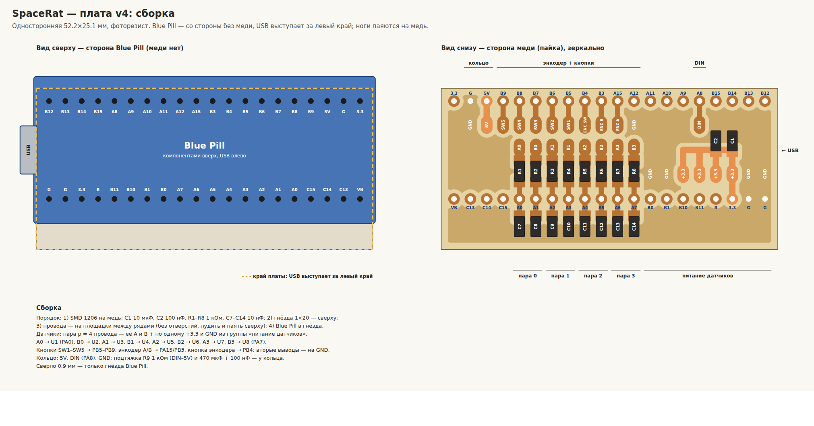

# SpaceRat — плата v4 (односторонняя, фоторезист)

Плата под гребёнки Blue Pill: **52.2 × 25.1 мм**. Blue Pill ставится на гнёзда
со стороны **без меди**, USB-разъём выступает за левый край платы. Ноги гнёзд паяются
на медь. На стороне меди: SMD (C1/C2 и RC-фильтры R1–R8 / C7–C14) и все площадки под провода.
Датчики, кнопки, энкодер и кольцо подключаются проводами.



| Файл | Что |
|---|---|
| [`spacerat_film.pdf`](spacerat_film.pdf) | **для печати на плёнку**: негатив и позитив 1:1, по 2 копии, линейка 50 мм |
| [`spacerat_film.svg`](spacerat_film.svg) | то же в SVG (размеры в мм) |
| [`spacerat_assembly.svg`](spacerat_assembly.svg) / [`.png`](spacerat_assembly.png) | сборка: вид сверху (Blue Pill) и снизу (медь, зеркально) |
| [`spacerat_film_preview.png`](spacerat_film_preview.png) | превью листа с шаблонами |
| [`gen_pcb.py`](gen_pcb.py) | генератор + проверка платы |

## Параметры

| | |
|---|---|
| Размер | 52.2 × 25.1 мм, медь с одной стороны; Blue Pill (53 × 22.9) нависает по бокам |
| Дорожки | 0.8 мм сигнал, 1.0 мм питание; зазоры ≥ 0.6 мм, свободная медь — земля |
| Гнёзда Blue Pill | круглые площадки Ø1.8, сверло 0.9 мм |
| Площадки под провода | овальные 1.8 × 2.8, шаг 2.54, **без отверстий** — провод паяется на площадку |
| SMD, 1206 | C1 10 мкФ и C2 100 нФ — у пина 3.3; R1–R8 1 кОм — между рядами над PA0–PA7; C7–C14 10 нФ — под нижним рядом, у пинов |
| Крепёж | отверстий нет: плату держит корпус (паз/клей), Blue Pill — гнёзда |

## Что где

Всё прямо под своими пинами, дорожки — короткие вертикальные:

- **Верхний ряд площадок** (под верхним рядом гнёзд):
  DIN кольца (PA8) · GND · **ENC A · ENC B · ENC SW · SW1 · SW2 · SW3 · SW4 · SW5** · 5V · GND.
  Энкодер и кнопки — одним рядом, общий GND слева от них.
- **Нижний ряд площадок** (над нижним рядом гнёзд):
  GND GND · +3.3 ×4 · GND GND, справа — B3 A3 · B2 A2 · B1 A1 · B0 A0.
  Пара датчиков p = её A и B + одна пара +3.3/GND из левой группы.
- **RC-фильтр каждого входа** — прямым столбиком по схеме: площадка провода —
  R (1 кОм, между рядами) — пин PAx — C (10 нФ, под нижним рядом, на землю).

Номера датчиков: A0 → U1 (PA0), B0 → U2, A1 → U3, B1 → U4, A2 → U5, B2 → U6, A3 → U7, B3 → U8 (PA7).

### Изменения относительно прежних версий

- **v4:** RC-фильтры R1–R8 / C7–C14 на плате (R — между рядами над PA0–PA7, C — под нижним
  рядом), плата 52.2 × 25.1 мм. v3 (52.2 × 19.2, без RC) — только в истории git.

- **Кнопки и энкодер переехали на подряд идущие пины:** энкодер A/B → PA15/PB3
  (TIM2, ремап 1), кнопка энкодера → PB4, кнопки SW1–SW5 → PB5–PB9.
  JTAG выключен прошивкой (`SwjCfg::SwdOnly`), прошивка по SWD работает как раньше.
- **Подтяжка R9 (DIN–5V) — у кольца**, вместе с его 470 мкФ + 100 нФ.

## ⚠️ До травления: проверить Blue Pill

Разводка рассчитана на распространённую распиновку (вид сверху, USB слева) и
**15.24 мм (0.6")** между рядами:

```
верхний ряд: B12 B13 B14 B15 A8 A9 A10 A11 A12 A15 B3 B4 B5 B6 B7 B8 B9 5V G 3.3
нижний ряд:  G   G   3.3 R   B11 B10 B1 B0 A7 A6 A5  A4 A3 A2 A1 A0 C15 C14 C13 VB
```

Распечатайте сборочный чертёж 1:1, положите Blue Pill компонентами вверх и сверьте
подписи с **видом сверху**. На **виде снизу** (медь) пины подписаны зеркально — так
их видно при пайке.

## Изготовление (фоторезист)

1. **Шаблон:** напечатать `spacerat_film.pdf` на прозрачной плёнке лазерным
   принтером, масштаб **100 %** («по размеру страницы» — выключить), максимальная
   плотность тонера. **Не зеркалить.** Проверить линейку — 50 мм.
   - **Негатив** (медь прозрачная) — для **плёночного** фоторезиста (Kolon, Riston и т.п.).
   - **Позитив** (медь чёрная) — для **жидкого позитивного** (Positiv 20 и т.п.).
   - Две копии на листе: если тонер просвечивает, сложить две плёнки точно друг на друга.
2. **Экспонирование:** плёнку класть **тонером к меди** и прижать стеклом.
   Самопроверка: на плёнке надпись **SPACERAT v4** зеркальная, на готовой меди
   читается **прямо**.
3. Проявить, травить, снять фоторезист — по инструкции к вашему резисту.
4. **Сверлить** только гнёзда Blue Pill: 0.9 мм (точки в центрах площадок).
5. Залудить.

## Сборка

1. **SMD 1206** — на медь: C1 10 мкФ, C2 100 нФ, R1–R8 1 кОм, C7–C14 10 нФ.
2. **Гнёзда 1×20** — со стороны без меди, пайка на медь.
3. **Провода** — на площадки между рядами: площадку залудить, провод облудить,
   припаять сверху. Площадки GND сидят в заливке — прогревать дольше.
4. **Blue Pill** — в гнёзда компонентами вверх, USB к левому краю.

Не на плате (как на схемах): 100 нФ у каждой пары датчиков; у кольца — R9 1 кОм
(DIN–5V), 470 мкФ + 100 нФ; 10 нФ на выводах энкодера (опционально).

## Что проверяет генератор

`python3 gen_pcb.py` (нужен `pip install shapely`; для PDF — Chromium):

- зазор между любыми двумя цепями ≥ 0.5 мм (сейчас минимум 0.6 мм);
- каждая цепь — одно целое; каждая площадка и вывод SMD — на своей цепи;
- каждый кусок заливки земли сидит на пине G Blue Pill (кусок у кольца — на своём
  верхнем G: ток кольца не идёт через землю датчиков); «острова» и перемычки уже
  0.6 мм удаляются;
- медь не ближе 1.08 мм к краю платы.

При ошибке файлы не пишутся. Масштаб PDF проверен: плата 52.22 × 25.10 мм,
линейка 50.00 мм. Цепи совпадают со схемами в [`../docs/hardware`](../docs/hardware).

Плата спроектирована и проверена генератором, **но ещё не изготавливалась**.
